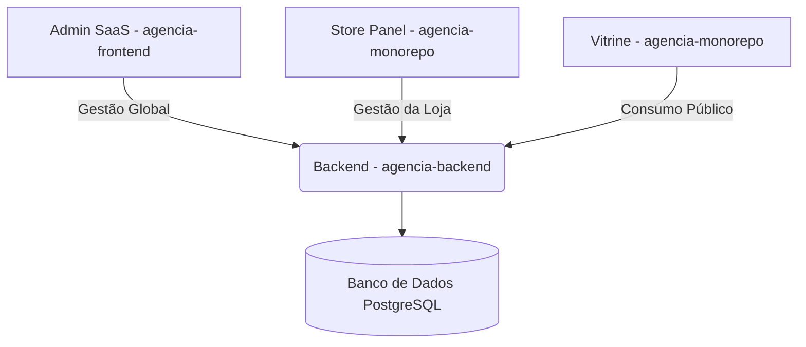

# Arquitetura do Sistema - Agência em 1 Click

Este documento descreve a organização técnica e o fluxo de dados do ecossistema SaaS Agência em 1 Click.

## 🏗️ Macro-Arquitetura

O sistema é dividido em três módulos principais que consomem a mesma infraestrutura de Backend.

### 1. Módulo de Administração (Admin)

- **Foco**: Gestão de infraestrutura de negócio.
- **Entidades**: Localizações (Cidades), Segmentos (Categorias de loja) e Usuários com role `ADMIN`.

### 2. Módulo do Lojista (Store Manager)

- **Foco**: Operação comercial.
- **Entidades**:
  - `Establishment`: Perfil da loja (Logo, redes sociais, flag `showPrice`).
  - `Offer`: Produtos e promoções individuais.
  - `Publication`: Encartes ou campanhas que agrupam ofertas.

### 3. Vitrine (Frontend Público)

- **Foco**: Consumidor final e conversão.
- **Estética**: Silk & Glass (Premium).
- **Funcionalidades**: Busca por localização/segmento, visualização de ofertas e contato direto via WhatsApp.

## 🗄️ Modelo de Dados (Entidades Chave)

- **User**: Gerenciamento de acesso e multi-tenancy.
- **Establishment**: O ponto central da experiência do lojista.
- **Offer / Publication**: O conteúdo dinâmico da vitrine.
- **Follow**: Sistema de engajamento entre consumidor e loja.

## 🚀 Fluxo de Deploy

- **Backend**: `api.amorimdev.cloud` (Coolify)
- **Vitrine Prod**: `vitrine.amorimdev.cloud` (Deployado via Monorepo)

---

_Documento mantido pela equipe de arquitetura._
