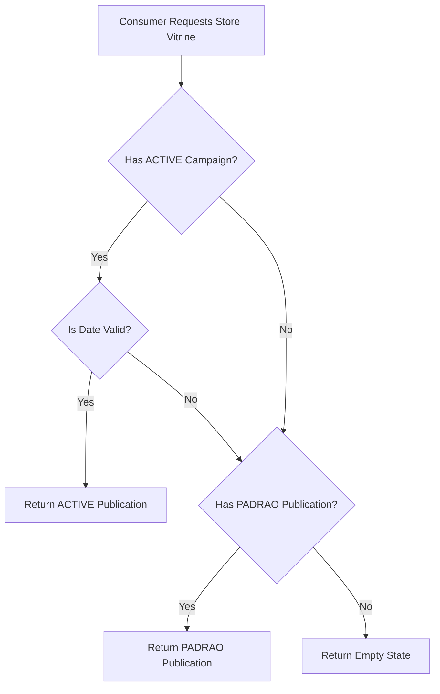

# Architecture & Design

## Fallback Logic



## Database Schema (Prisma)

### Current

```prisma
model Publication {
  active    Boolean @default(false)
  isDefault Boolean @default(false)
  status    String  @default("draft") // Used loosely
}
```

### Proposed

```prisma
model Publication {
  // active boolean removed (implied by status)
  // isDefault boolean removed (implied by status)
  status String @default("DRAFT") // DRAFT, ACTIVE, PADRAO, ARCHIVED
}
```

## Migration Strategy

1. **DRAFT**: Keep as `DRAFT`.
2. **ACTIVE**: If `active=true` AND `isDefault=false` -> `ACTIVE`.
3. **PADRAO**: If `isDefault=true` -> `PADRAO` (regardless of `active` flag? Or maybe only if `active=true`? User needs to decide. Safest: If it was default, it becomes the new PADRAO).
